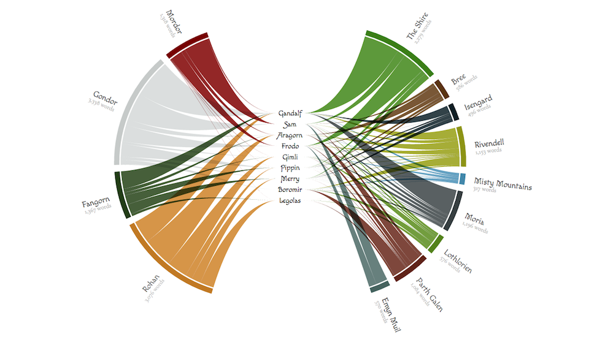

# d3-loom

This is, sort of, a d3 plugin to create a "loom" visualization

[](http://bl.ocks.org/nbremer/6599644129c034d0cb17fcdc452c310b)

## API Reference

<a href="#loom" name="loom">#</a> d3.<b>loom</b>()

Constructs a new loom generator with the default settings.

<a href="#_loom" name="_loom">#</a> <i>loom</i>(<i>data</i>)

Computes the loom layout for the specified *data*. The length of the returned array is the same as *data*, however, due to sorting of the strings, to reduce overlap, the ordering can be different than the initial data. 

Typically a dataset for the *loom* contains 3 values; the outer entity, the inner entity and the value that connects these two (e.g. outer = location, inner = person, value = days that person stayed in the location):

```js
var data = [
  {
    outer: "Amsterdam",
    inner: "Alexander",
    value: 679
  },
  {
    outer: "Bangkok",
    inner: "Brendan",
    value: 124
  },
  //...and so on
];
```

The return value of *loom*(*data*) is an array of *looms*, where each loom represents the connection between an entity in the center of the loom (the *inner*) and the entity on the outside of the loom (the *outer*) and is an object with the following properties:

* `inner` - the inner subgroup
* `outer` - the outer subgroup

Both the inner and outer subgroup are also objects. The inner has the following properties:

* `name` - the [name](#loom_inner) of the inner entity
* `offset` - the [horizontal offset](#loom_offset) of the inner string's endpoint
* `x` - the horizontal location of the inner entity
* `y` - the vertical location of the inner entity

And the outer has the following properties:

* `startAngle` - the [start angle](#loom_startAngle) of the arc in radians
* `endAngle` - the [end angle](#loom_endAngle) of the arc in radians
* `value` - the numeric [value](#loom_value) of the arc
* `index` - the zero-based [sorted index](#loom_sort) of the arc
* `subindex` - the zero-based [sorted sub-index](#loom_sub_sort) of the arc
* `innername` - the [name](#loom_inner) of the connected inner entity
* `outername` - the [name](#loom_outer) of the outer entity

The looms are passed to [d3.string](#string) to display the relationships between the inner and outer entities.

The *looms* array also defines a two secondary arrays. The first, called *groups*, is an array represting the outer entities. The length of the array is the number of unique outer entities and is an object with the following properties:

* `startAngle` - the [start angle](#loom_startAngle) of the arc in radians
* `endAngle` - the [end angle](#loom_endAngle) of the arc in radians
* `value` - the numeric [value](#loom_value) of the arc
* `index` - the zero-based [sorted index](#loom_sort) of the arc
* `outername` - the [name](#loom_outer) of the outer entity

The *groups* are passed to [d3.arc](https://github.com/d3/d3-shape#arc) to produce a donut chart around the circumference of the loom layout.

The other array, called, *innergroups*, is an array represting the inner entities. The length of the array is the number of unique inner entities and is an object with the following properties:

* `name` - the [name](#loom_inner) of the inner entity
* `offset` - the [horizontal offset](#loom_offset) of the inner string's endpoint
* `x` - the horizontal location of the inner entity
* `y` - the vertical location of the inner entity


<!-- 
		loom.padAngle = function(_) {
			return arguments.length ? (padAngle = max$1(0, _), loom) : padAngle;
		};

		loom.inner = function(_) {
			return arguments.length ? (inner = _, loom) : inner;
		};

		loom.outer = function(_) {
			return arguments.length ? (outer = _, loom) : outer;
		};

		loom.value = function(_) {
			return arguments.length ? (value = _, loom) : value;
		};

		loom.heightInner = function(_) {
			return arguments.length ? (heightInner = _, loom) : heightInner;
		};

		loom.widthOffsetInner = function(_) {
			return arguments.length ? (widthOffsetInner = typeof _ === "function" ? _ : constant$11(+_), loom) : widthOffsetInner;
		};

		loom.emptyPerc = function(_) {
			return arguments.length ? (emptyPerc = _ < 1 ? max$1(0, _) : max$1(0, _*0.01), loom) : emptyPerc;
		};

		loom.sortGroups = function(_) {
			return arguments.length ? (sortGroups = _, loom) : sortGroups;
		};

		loom.sortSubgroups = function(_) {
			return arguments.length ? (sortSubgroups = _, loom) : sortSubgroups;
		};

		loom.sortBands = function(_) {
			return arguments.length ? (_ == null ? sortBands = null : (sortBands = compareValue(_))._ = _, loom) : sortBands && sortBands._;
		};


		string.radius = function(_) {
			return arguments.length ? (radius = typeof _ === "function" ? _ : constant$11(+_), string) : radius;
		};

		string.startAngle = function(_) {
			return arguments.length ? (startAngle = typeof _ === "function" ? _ : constant$11(+_), string) : startAngle;
		};

		string.endAngle = function(_) {
			return arguments.length ? (endAngle = typeof _ === "function" ? _ : constant$11(+_), string) : endAngle;
		};

		string.x = function(_) {
			return arguments.length ? (x = _, string) : x;
		};

		string.y = function(_) {
			return arguments.length ? (y = _, string) : y;
		};

		string.offset = function(_) {
			return arguments.length ? (offset = _, string) : offset;
		};

		string.heightInner = function(_) {
			return arguments.length ? (heightInner = _, string) : heightInner;
		};

		string.inner = function(_) {
			return arguments.length ? (inner = _, string) : inner;
		};

		string.outer = function(_) {
			return arguments.length ? (outer = _, string) : outer;
		};

		string.pullout = function(_) {
			return arguments.length ? (pullout = _, string) : pullout;
		};

		string.context = function(_) {
			return arguments.length ? ((context = _ == null ? null : _), string) : context;
		}; -->